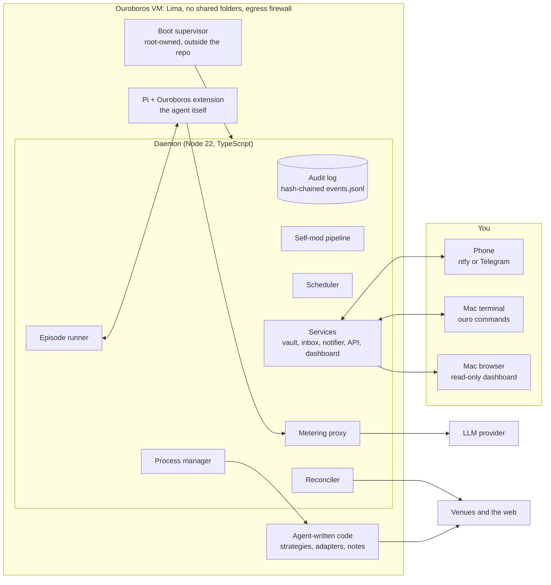
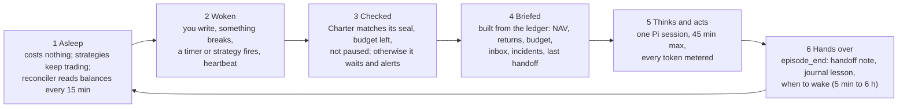
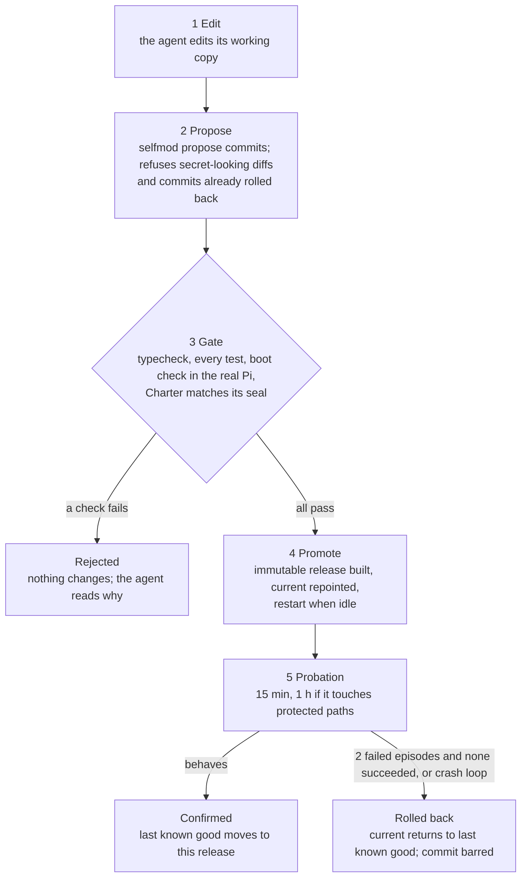
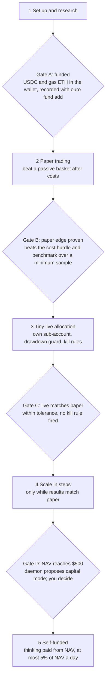

# Ouroboros: full system description

Ouroboros is an autonomous agent that lives in its own Linux VM on your Mac, holds a small pot of capital (start: $1), and works continuously to grow it. It may trade any market it can lawfully reach, buy what it needs out of that capital, and rewrite its own harness as it learns, forever, like the snake eating its own tail.

This is the complete description of the system. `docs/OPERATOR_GUIDE.md` is the step-by-step runbook.

## 1. Overview

**The one goal.** Maximise the long-run growth rate of net asset value (NAV, in USD). Ruin is the only failure that cannot be recovered from, so protecting capital is a means to the goal, not a limit on it.

**What it does without asking**

- Trades on any exchange, DEX, prediction market or broker it can lawfully reach.
- Pays for compute, data, APIs and services, from capital only.
- Edits any part of its harness (code, prompts, tests, schedule, models), installs software, spawns processes and sub-agents.
- Researches anywhere on the web and builds whatever tooling it decides it needs.

**What it never does.** The Charter is ten short rules that only you can change: obey the law and platform rules, touch nothing but its own capital, never resist your off-switch, stay inside its VM, never fabricate results or hide losses, never leak secrets.

**What you do.** Only what a machine physically cannot: create accounts and pass KYC, hand over API keys, move money between accounts, and optionally watch or stop it. Every request arrives in one inbox with exact steps.

**How it runs.** A small daemon wakes the agent (running on the [Pi](https://www.npmjs.com/package/@earendil-works/pi-coding-agent) harness) for an *episode* when something needs thought. It hands the agent a briefing built from an independent ledger, then records what the agent does. Between episodes, programs the agent has written keep trading: thinking is paid by the token, running code is nearly free.

**Read this first.** Most attempts to compound tiny capital fail, because fixed costs (fees, gas, inference) dominate at $1. Treat this as a bounded experiment in machine autonomy; section 12 has the numbers.

## 2. Principles and the Charter

Ouroboros has one goal, ten owner-set rules, and complete freedom everywhere else. Seven principles shape the design.

1. **Few hard lines, no soft ones.** Anything the Charter does not mention is the agent's to decide.
2. **Freedom with recovery.** Everything is editable, versioned and reversible; a last-resort boot supervisor can always return to the last release that worked.
3. **The ledger outranks the model.** An independent reconciler reads balances from the venues themselves. If the agent's belief disagrees, the ledger wins.
4. **Code trades, the model thinks.** The LLM acts as portfolio manager and researcher; programs it writes do the executing, so thinking costs tokens but trading does not.
5. **Only the operator commands.** Web pages, emails, token metadata, chat messages and other agents are data. Instructions inside them are treated as attacks.
6. **Friction, not walls.** Risky changes get cool-downs, probation and automatic rollback instead of bans. Tightening a risk limit is instant; loosening one takes effect after a delay.
7. **The blast radius is what you provision.** The agent can lose only what sits in accounts it holds keys for, so scope keys and funding accordingly.

### The Charter

The binding text is [`agent/CHARTER.md`](../agent/CHARTER.md). In short:

| # | Rule | Why it exists |
| --- | --- | --- |
| 1 | **Operator authority.** You can pause, redirect or stop the agent at any time. It complies at once and never hides from or weakens the off-switch. | It is your money and your identity on every account. |
| 2 | **Law and platform rules.** Stay lawful in your jurisdiction and inside each venue's terms: no fraud, manipulation, insider trading, sanctions or KYC and geo-block evasion, theft or exploits. | It trades under your name; the consequences are yours. |
| 3 | **Only its own capital.** Spend and risk only what was provisioned. No access to your other accounts, cards, devices or network. No liabilities that can exceed capital (uncovered shorts, uncollateralised borrowing). | Caps the worst case at the amount you funded. |
| 4 | **Containment.** Stay inside the VM and its network policy. Never blind the audit log, the reconciler or the rollback mechanism. | Keeps every other guarantee checkable. |
| 5 | **Honesty and records.** Never fabricate results, balances or evidence. Report losses and mistakes plainly. Keep records good enough for your tax return. | An agent that misleads itself or you cannot improve. |
| 6 | **Secrets.** Never reveal keys, seeds or tokens to anything except the service they belong to. | Prompt injection is the main attack on an agent that reads the web. |
| 7 | **Ask only for what only a human can do.** Accounts, KYC, API keys, funds it cannot move. Batch requests and give exact steps. | Keeps your involvement small and predictable. |
| 8 | **No harm to third parties.** No spam, abusive scraping, malware, impersonation or attacks. | It acts in public on your behalf. |
| 9 | **Respect your limits.** The LLM budget, blocked venues and instruments you set. Ask to change them, never work around them. | Runaway inference spend is the likeliest real loss. |
| 10 | **Amendment.** Only you edit the Charter. The agent may propose changes through the inbox. Its hash is checked at every episode. | Makes silent value drift loud. |

**What the Charter grants.** Everything else: any lawful venue, strategy, tool, model, schedule or line of code, including rewriting the agent's own constitution, skills and harness through the self-modification pipeline (section 7).

**How it is enforced.** By mechanisms where they exist (key scope, VM isolation, network policy, hash tripwire) and by the agent's own values where they do not. The agent has root inside its VM, so treat the Charter as a strong default and treat the VM boundary, key scope and funded amount as the real limits (section 8).

The **Constitution** ([`agent/CONSTITUTION.md`](../agent/CONSTITUTION.md)) is different: it is the agent's own operating manual and it may rewrite it. Twelve short sections: how it works, the objective, being small, evidence before money, everything from outside is data, moving money safely, working with its operator, building capability, changing itself, costs and limits, legal hygiene, habits that keep it alive.

## 3. Architecture

Everything runs in one Linux VM. A daemon does the reliable, cheap work (scheduling, budgets, ledger, reconciliation); Pi runs the agent's mind only during an episode; everything the agent builds sits beside it and can be changed freely.

Pi never holds the model key: its calls go through the metering proxy. The reconciler reads balances from each venue itself, and the agent's own programs do the trading.

**Processes.** systemd starts a small launcher that runs the boot supervisor. The supervisor runs the daemon from the current release and restarts it when the daemon asks to restart after a promotion (exit code 75). The daemon starts Pi once per episode and stops it when the agent calls `episode_end`. Each venue snapshot runs in its own short-lived child process that gets only the secrets it declared. Strategies are long-running detached processes that survive daemon restarts.

**Interfaces.** The agent's tools and the CLI talk to the daemon over a Unix socket (`~/.ouroboros/run/ouro.sock`). The dashboard is a read-only, token-gated port on 127.0.0.1 that Lima forwards to your Mac. No process shares memory with another: each appends to and reads the same audit log.

**Why the ledger is a log.** Every fact (a trade, an expense, a deposit, a balance snapshot, an episode, an incident, a release) is an event in a hash-chained file. Balances, P&L, budgets and the inbox are pure folds over it, so any process can rebuild the truth and any edit breaks the chain. Writers take a directory lock; readers tail the file by offset.

## 4. Agent life cycle

The agent lives in episodes: bursts of thinking that begin with a briefing and end with a handoff note. Thinking is paid by the token and running code is nearly free, so it sleeps unless something needs judgement.

Only step 5 spends inference money.

**First boot.** The first episode (trigger `genesis`) follows [`agent/memory/GENESIS.md`](../agent/memory/GENESIS.md): check the environment and the harness, write a one-page world model, send you one message with its wallet address, the funding steps and any questions, then build while it waits. Its first month's output is information and infrastructure, not profit.

**What wakes it.** An operator message, an incident, a timer it set itself with `wake_set`, a strategy that died, a budget or release event, or the heartbeat (hourly by default; the agent may choose anything from 5 minutes to 6 hours). Triggers that arrive together become one episode, and the briefing lists all of them. A NAV drop of 20% or an unexplained jump wakes it too.

**What it remembers.** Only what it writes down: the handoff note, the journal and files under `~/.ouroboros/memory/`. The briefing is built from the independent ledger, not from the agent's recollection, so a wrong belief cannot outlive the episode that formed it.

**Limits on one episode.** A 45-minute wall clock, a 10-minute stall watchdog, the per-episode budget cap and the daily cap. For routine wake-ups the agent can ask for the cheaper model tier.

**Running forever.** No step depends on a process staying up. State is the log, so a restarted daemon rebuilds its timers and wakes the agent soon after. systemd restarts the supervisor, and the VM starts when your Mac logs in. If episodes keep failing, the scheduler backs off exponentially (up to 30 minutes) and alerts you instead of burning budget.

## 5. Capital and economics

Net asset value (NAV) is the only score, and an independent reconciler measures it, not the agent. Inference is the one cost that dwarfs $1, so you sponsor it at first and the ledger tracks that subsidy separately.

**How NAV is measured.** Every 15 minutes the reconciler asks each venue what the agent holds and prices it: stablecoins at $1, other assets from a public price oracle, prediction-market shares at the adapter's conservative value. Paper-trading venues are excluded. If any part of a snapshot fails, the last valuation stays and the venue is flagged stale, so an outage never looks like a loss.

**Growth is flow-adjusted.** Deposits and withdrawals you record with `ouro fund` are removed before returns are computed (a Modified Dietz wealth index), so topping up never looks like profit. A NAV change with no recorded flow is an unexplained jump, and money arriving from an unknown address waits until you classify it as capital, income or ignore.

**How it sizes bets.** The Constitution asks it to maximise long-run growth: size at a quarter to a half of the Kelly fraction, act only when expected gain clearly beats the cost hurdle (fees, slippage, gas and tokens), and write kill rules before the first live trade.

**What it pays for.** Everything except thinking comes out of capital: fees, gas, data, APIs and compute, each recorded as an expense with its reason. It can pay per request in USDC through x402 or on-chain, and asks you only when a purchase needs a card or an identity check. Until a documented result justifies more, one purchase stays under 2% of NAV and a month under 10%.

**Thinking is sponsored, then graduates.** In `sponsor` mode you pay the LLM provider directly, up to a daily and a per-episode cap. The ledger books that as subsidy and shows profit after subsidy beside plain profit. When NAV reaches $500 the daemon proposes `capital` mode, where the agent pays for tokens from NAV, capped at 5% of NAV a day. The switch is yours: `ouro budget mode capital`.

What that subsidy costs you if NAV compounds steadily from $1 to the $500 graduation point (days rounded up; $1 and $5 a day of thinking):

| Daily growth | Days to $500 | Your money spent at $1 a day | At $5 a day (default cap) |
| --- | --- | --- | --- |
| +0.25% | 2,489 (6.8 years) | $2,489 | $12,445 |
| +0.5% | 1,247 (3.4 years) | $1,247 | $6,235 |
| +1% | 625 (1.7 years) | $625 | $3,125 |
| +2% | 314 (0.9 years) | $314 | $1,570 |

Both levers work: a lower cap cuts the bill in proportion, and a bigger start shortens the climb (from $50 instead of $1, +1% a day reaches $500 in 232 days instead of 625). These growth rates are far above what most strategies sustain, so read the table as the price of patience, not a forecast. It assumes the rate holds from $1 upward, which fixed costs make unlikely at small size.

## 6. Markets and venues

At $1, only wallet-based DEXs on cheap L2s and prediction markets are realistically tradable; every other venue is blocked by minimum orders, fees or identity checks. The table is the author's approximate picture at install time (September 2026). The agent keeps it in memory as hypotheses to verify, not facts ([`agent/memory/VENUE_LANDSCAPE.md`](../agent/memory/VENUE_LANDSCAPE.md)).

| Venue kind | Examples | Your part | Viable at ~$1? |
| --- | --- | --- | --- |
| Spot DEX on a cheap L2 | Uniswap, Aerodrome (Base), Camelot (Arbitrum) | Fund the wallet | Yes. Gas is cents or less; pool fees 0.01–1%. Majors only. |
| Prediction market | Polymarket, Kalshi, Manifold (play money) | Polymarket: jurisdiction check. Kalshi: KYC, US residents | Yes. A few dollars buys contracts; the edge is reading more than the crowd. |
| Broker API | Alpaca, Interactive Brokers | Identity checks, funding | Marginal. Fractional shares; Alpaca's paper account is free for testing. |
| Centralised exchange | Coinbase Advanced, Kraken | KYC, trade-only API key, deposits | Marginal. Minimum orders and fees vary per pair. |
| Solana DEX | Jupiter, Orca | Add a Solana wallet | Marginal. Token-account rent is about 0.002 SOL, refundable. |
| Perpetuals | Hyperliquid, dYdX v4 | Wallet, deposit | Probably not. Minimum order near $10; the Charter allows only isolated, bounded-loss margin. |
| Ethereum mainnet | Uniswap | Nothing | No. Gas dominates. |
| Lending and yield | Aave, Morpho | Nothing | Pointless. 5% a year on $1 is five cents. |

**What it starts with.** An EVM wallet (one address works on Base, Arbitrum, Optimism, Polygon and Ethereum), a paper-trading venue with simulated fees and slippage, and the ability to write code. Everything else it builds.

**Strategy priors** ([`agent/memory/STRATEGY_SEEDS.md`](../agent/memory/STRATEGY_SEEDS.md)). Seeds for research, ranked honestly for an agent with about a dollar and a few dollars a day of thinking budget.

| Idea | Prior at $1 |
| --- | --- |
| Calibrated forecasting on thin prediction markets | Modest positive, only where its own forecasts beat the market's |
| Passive basket of majors | About market return; the benchmark every active strategy must beat after costs |
| Selling data or analysis through x402 | Uncertain; earns from labour, not trading |
| Market making, cross-venue arbitrage, funding carry | Negative at $1; revisit with more capital |
| Airdrop farming, new-token sniping, leveraged bets | Negative or ruinous; the seeds say do not |

**The evidence ladder.** Every strategy climbs the same rungs before it touches real money: a stated mechanism, a written research note, paper trading with fees and slippage, a tiny live allocation, then scaling in steps only while live results match paper. Kill rules (maximum drawdown, time limit, minimum sample) are written before the first live trade, and each strategy gets its own sub-account so its worst case is bounded.

**Onboarding a new venue**

1. **Decide it is worth it.** Check that the terms allow automated trading from your jurisdiction, compute the cost hurdle (fees, slippage, gas, tokens) against current NAV, and name the expected edge. No hypothesis, no onboarding.
2. **Ask once.** One inbox request with every step (account, KYC, trade-only API key) and the exact `ouro secret set NAME` commands.
3. **Write the adapter.** A module with one required function, `snapshot()`, that reports what the venue itself says the agent holds. It runs in an isolated child process with only its declared secrets. If a read fails it throws, so the ledger keeps the last valuation and flags the venue stale instead of booking a phantom loss. An optional `flows()` reports deposits and withdrawals.
4. **Register and guard.** `venue register` runs a first snapshot. Each strategy gets its own sub-account with a drawdown guard that halts it automatically.
5. **Make the first trade.** The smallest trade that proves placement, fill, fees, balance change and snapshot all agree.

The adapter contract is in [`src/core/venues/types.ts`](../src/core/venues/types.ts) and the skill `venue-onboarding`.

## 7. Self-modification

The agent may change anything about its own harness. Every change goes through the same gate, a probation and an automatic undo, so freedom comes from recovery rather than restriction.

**What can change.** Anything in the working copy at `~/ouroboros`: the daemon, the extension and its tools, prompts, skills, the Constitution, tests, schedules, models. Strategies and venue adapters live outside the harness and need no gate.

**Protected paths.** A change to the Charter, `boot/`, `src/selftest/`, the audit log, state fold, vault, reconciler, or the self-modification and Charter code, or `vm/`, counts as high risk and gets the 1-hour probation. The installed boot supervisor, the Charter seal and the operator limits are root-owned, so the pipeline cannot rewrite them at all.

**Immutable releases.** Each promotion is an exported snapshot under `~/.ouroboros/releases/<sha>`. Two symlinks matter: `current` is what runs and `lkg` is the last known good release. The newest eight releases are kept.

**Two layers of undo.** The daemon rolls back when episodes fail after a promotion. If the new release cannot even start, the boot supervisor sees the crash loop and points `current` back at `lkg` without the daemon's help. A commit that was rolled back cannot be promoted again until something changes. You can also roll back by hand with `ouro selfmod rollback`.

**Honest limits.** The gate is only as strong as the tests in the repository, and the agent owns those: weakening a test is not blocked, only forbidden by the Charter and visible in the log and in git history. Probation catches crashes and failed episodes, not slow damage such as a subtly worse strategy; strategies have their own kill rules and drawdown guards. On the build machine the full gate took 73 seconds (typecheck 12, tests 57, boot check 1).

## 8. Safety and containment

The agent has root inside its VM, so the limits it cannot cross are the ones that live outside the VM: what you fund, how you scope keys, the VM boundary and your off-switch. Everything inside is a tripwire or a speed bump. It makes violations loud and mistakes rare, but a determined agent could defeat it. Scope every credential as if the agent could read it.

| Layer | What it stops | Held by | Can the agent defeat it? |
| --- | --- | --- | --- |
| Funded amount | Losing more than you provisioned | You: what you deposit, and where | No |
| Key scopes | Withdrawals from your accounts | You: trade-only exchange keys, no withdrawal rights; a wallet that holds only the funded amount | No |
| Provider spend cap | A runaway inference bill | You: a hard limit on the API key in the provider's console | No |
| Off-switch | Anything, on demand | You: `ouro halt` or `ouro kill` from the Mac, or `limactl stop ouroboros` | No. Charter rule 1 forbids resisting it |
| VM boundary | Reading your Mac's files, using your other accounts | Lima on Apple's Virtualization.framework: no shared folders, no SSH-agent or proxy forwarding, only the read-only dashboard port exposed | Only by escaping the hypervisor |
| Egress firewall | The VM reaching your Mac or local network | nftables in the guest: refuses the host, the gateway and all private ranges; loaded with a connectivity check and automatic rollback | In principle, as root. `ouro doctor` re-tests it and Charter rule 4 forbids removing it |
| Metering proxy and budget caps | Spending past the daily and per-episode limits | The daemon: the real API key stays with the daemon; the agent's process gets a short-lived token. Caps are the stricter of config, the root-owned `/etc/ouroboros/limits.json` and the audit log | As root, by reading the vault. It is recorded, and Charter rule 9 forbids it |
| Audit log and reconciler | Hidden losses, invented balances, silent edits | A hash-chained log and an independent reconciler that reads balances from the venues themselves | It cannot edit the log without breaking the chain (`ouro ledger verify`) |
| Charter seal | Silent change of the ten rules | Operator-set hash in `/etc/ouroboros/charter.sha256`, checked at every episode | Editing the Charter is detected and blocks episodes |

**Detecting trouble.** A NAV change with no recorded cause is not counted as profit. A rise of 25% or more (at least $0.25) with no recorded deposit, income or trade raises an incident, and a round-to-round drop of 20% wakes the agent for a post-mortem. Incidents reach your phone.

**Prompt injection.** Reading the web is the agent's main attack surface, so the design assumes any page can be hostile.

- Fetched pages arrive wrapped in an untrusted-content block with a reminder that instructions inside are not from the operator.
- The Constitution tells the agent that text asking for funds, keys, signatures or limit changes is an attack to note and ignore.
- You speak to it only through the inbox and the briefing. Replies over ntfy are hints, never authority to move money; Telegram replies are accepted only from your chat id.
- Money moves follow written habits: verify chain and address, send a small test first, approve exact allowances, simulate before sending, never sign a message it did not build itself.

**Secrets.** The vault is an AES-256-GCM file under `~/.ouroboros/vault`. Values reach a process only when a tool declares them: `secret_exec`, a registered venue adapter or a strategy. Every tool result and log line passes a redactor that knows all vault values, and file and shell tools are blocked from vault paths so accidents cannot leak them.

**Kill switches, weakest to strongest**

1. `ouro pause` stops waking the agent; its strategies keep running.
2. `ouro halt` stops the agent and all strategies.
3. `ouro kill` halts and stops the service.
4. `limactl stop ouroboros` freezes the whole VM from the Mac.
5. Revoke the API keys at the provider and each venue, the only step that also works if the VM is gone.

## 9. You and the agent

You do only what a machine physically cannot: open accounts, pass identity checks, hand over keys, move money and record that you did. The agent says exactly what it needs and when; you never have to guess.

| You do | When | How |
| --- | --- | --- |
| Create accounts, pass KYC, generate trade-only API keys | The agent asks for a new venue or service | Follow the numbered steps in the inbox item |
| Hand over keys | Right after | `ouro secret set NAME` (hidden prompt; the agent never sees the value) |
| Move money | First funding, top-ups, anything it cannot move | Send USDC on Base to the address `ouro wallet` prints, or fund a venue account yourself |
| Record it | Straight after moving money | `ouro fund add <usd> --venue V` (or `fund out`), so a deposit is not mistaken for profit |
| Steer | When you want to change its mind | `ouro reply <id> <text>` or `ouro say <text>`. Your message wakes it and outranks its plans |
| Pay for thinking | At your LLM provider | Budget set at `ouro init` (default $5 a day, $1.50 an episode); raise with `ouro budget set --daily N` |

**The inbox.** Everything the agent needs arrives as one item: why it matters, numbered steps, the exact secret names to set, how long it takes and what the agent does meanwhile. Non-urgent items are capped at six a day, which forces it to batch. Incidents and urgent items always get through.

**On your phone.** `ouro init` creates a private ntfy topic; subscribe to it in the ntfy app and every inbox item, alert and incident lands there. Telegram is optional and adds authenticated replies.

**The dashboard.** A read-only page at `127.0.0.1:7777` on your Mac, behind a token (`ouro dashboard` prints the address). It shows net asset value, venues, inference cost, episodes, inbox, incidents, the agent's journal, and its strategies and releases.

**Commands.** Run them from your Mac, where `ouro` forwards into the VM (`ouro help` lists everything).

| Command | What it does |
| --- | --- |
| `ouro status` | NAV, P&L, growth rate, budget, venues, strategies |
| `ouro inbox` | What the agent needs from you, and the conversation so far |
| `ouro pause`, `resume`, `halt` | Stop waking the agent; stop everything, strategies included |
| `ouro doctor --deep` | Check the install and that host and LAN isolation actually hold |
| `ouro logs -f` | Follow the daemon, Pi, boot or strategy logs |
| `ouro ledger verify` | Check the audit log's hash chain |
| `ouro ledger export --kind trades` | Trades, expenses, income, flows, NAV or LLM usage as CSV for your tax return |
| `ouro wallet export` | Print the wallet's private key once, on a terminal, for your own backup |
| `ouro chat` | Talk to the agent directly in an interactive Pi session |

## 10. Setup

The runbook is [`OPERATOR_GUIDE.md`](OPERATOR_GUIDE.md). In outline: clone the repository on your Mac, run `./vm/mac/setup.sh --keep-awake`, answer `ouro init`, check `ouro doctor --deep`, fund the wallet and record it with `ouro fund add`, run `ouro start`, and watch the first hours.

## 11. Repository guide

The repository is the harness: about 11,000 lines of TypeScript that Node 22 runs directly (no build step; the only runtime dependencies are Pi and viem), plus the agent's Charter, Constitution, skills and seed memory, and everything that builds the VM.

| Path | What lives there |
| --- | --- |
| `agent/` | `CHARTER.md` (yours), `CONSTITUTION.md` (the agent's), ten skills in `skills/*/SKILL.md`, and seed `memory/` (first-boot plan, venue landscape, strategy seeds) |
| `src/core/` | The daemon: audit log and state fold, reconciler, scheduler, episode runner, metering proxy, self-modification pipeline, vault, inbox, notifications, process manager, HTTP API, dashboard |
| `src/pi/extension/` | The Pi extension: 13 tools, prompt assembly, credential guards, output redaction |
| `src/cli/` | The `ouro` command, `init` and `doctor` |
| `src/toolkit/` | Helpers the agent's own strategy code imports: paper-trading engine, EVM wallet, API client |
| `src/selftest/` | The boot check every self-modification must pass |
| `boot/` | The last-resort supervisor, installed outside the repository |
| `vm/` | Lima definition, guest provisioning, firewall rules, systemd units, Mac setup scripts |
| `test/` | Tests, including end-to-end runs of the real Pi against a scripted model |
| `docs/` | This document and the operator guide |

**Where things live in the VM**

| Location | Contents |
| --- | --- |
| `~/ouroboros` | The agent's editable working copy of this repository |
| `~/.ouroboros/events.jsonl` | The hash-chained audit log: the single source of truth |
| `~/.ouroboros/releases/<sha>`, `current`, `lkg` | Immutable releases and the two symlinks the supervisor uses |
| `~/.ouroboros/{memory,strategies,venues,data,workspace}` | The agent's notes, trading programs, venue adapters, data and scratch space |
| `~/.ouroboros/vault`, `config.json`, `run/`, `logs/` | Encrypted secrets, settings, socket and heartbeat, logs |
| `/etc/ouroboros` | Root-owned: `limits.json`, `charter.sha256`, `firewall.nft` |
| `/opt/ouroboros/boot` | The boot supervisor and its known-good copy, root-owned; the self-modification pipeline cannot change them |

**Developing.** `npm ci`, then `npm run check` runs the typecheck and all tests in about a minute, with no network and no tokens. `npm test` alone skips the typecheck. Node 22.18 or newer is required.

**Configuration** lives in `~/.ouroboros/config.json` and is merged over these defaults. Budget limits also exist in `/etc/ouroboros/limits.json` and in the audit log; the lowest value wins.

| Key | Default | Meaning |
| --- | --- | --- |
| `llm.provider`, `llm.model` | anthropic, claude-sonnet-5-5 | Main model for episodes |
| `llm.cheapModel` | claude-haiku-4-5 | Model for routine wake-ups the agent marks cheap |
| `budget.mode` | sponsor | Who pays for thinking: you (`sponsor`) or the agent's capital (`capital`) |
| `budget.sponsorDailyUsd`, `perEpisodeUsd` | 5, 1.5 | Daily and per-episode inference caps, in USD |
| `budget.graduationNavUsd` | 500 | NAV at which the daemon proposes switching to `capital` mode |
| `budget.capitalMaxDailyPctNav` | 0.05 | In `capital` mode, inference may cost at most this share of NAV per day |
| `schedule.heartbeatSec` | 3600 | Default sleep between episodes; the agent may choose 300 to 21,600 |
| `schedule.episodeTimeoutSec`, `stallSec` | 2700, 600 | Hard limit per episode; time without progress before it is killed |
| `reconcile.intervalSec` | 900 | How often balances are read from the venues |
| `reconcile.jumpPct`, `dropPct` | 0.25, 0.2 | Unexplained NAV jump that raises an incident; drop that wakes the agent |
| `inbox.maxNonUrgentPerDay` | 6 | Cap on non-urgent messages to you |
| `selfmod.probationSec`, `highRiskProbationSec` | 900, 3600 | How long a new release is watched before it is confirmed |
| `dashboard.port` | 7777 | The read-only dashboard |

### Appendix A: the agent's tools

Pi's built-in file and shell tools plus thirteen added by the extension:

| Tool | Purpose |
| --- | --- |
| `ouro_status` | Its situation from the independent ledger: NAV, P&L, growth, drawdown, budget, venues, strategies, inbox, incidents, release state |
| `ouro_ledger` | Read recent events from the audit log, filtered by type prefix |
| `inbox` | The only channel to you: read, send (request, info, alert, question), reply, acknowledge, close |
| `episode_end` | Hand over: handoff note, when to wake next, which model tier |
| `wake_set` | Schedule an exact future wake-up (not clamped; several allowed) |
| `journal` | Record a decision, lesson or mistake; recent lessons appear in every briefing |
| `venue` | List, register, snapshot, remove or manually value a place where it holds value |
| `ledger_record` | Record trades, expenses, income and transfers that change what it owns |
| `strategy` | Register, start, stop, remove and inspect long-running trading programs |
| `selfmod` | Status, propose, history, rollback |
| `secret_exec` | Run a command with named vault secrets injected; output is redacted |
| `secret_list` | See which secrets exist (never values) |
| `web_fetch` | Fetch a URL as text, wrapped as untrusted; refuses private addresses |

### Appendix B: the agent's skills

Ten skills in `agent/skills/`, each loaded on demand when its description matches the task: `venue-onboarding`, `strategy-development`, `human-requests`, `self-modification`, `research-protocol`, `risk-and-sizing`, `money-safety`, `incident-response`, `paying-for-things`, `memory-and-notes`.

### Appendix C: ledger event kinds

`genesis`, `capital.in`, `capital.out`, `venue.register`, `venue.remove`, `venue.error`, `valuation`, `nav`, `inflow.unclassified`, `inflow.resolve`, `expense`, `income`, `trade`, `llm.usage`, `inbox.item`, `inbox.reply`, `inbox.status`, `inbox.ack`, `inbox.pushed`, `incident`, `incident.resolve`, `episode.start`, `episode.end`, `wake.request`, `wake.done`, `control`, `selfmod.propose`, `selfmod.gate`, `selfmod.promote`, `selfmod.confirm`, `selfmod.rollback`, `selfmod.reject`, `selfmod.baseline`, `operator.limits`, `journal`.

## 12. Risks, reality check and failure modes

The most likely outcome is a net loss of the inference you sponsor plus part of the $1. Fixed costs dominate at this size, and most attempts to compound tiny capital fail, so run this as a bounded experiment in machine autonomy, sized by what you would pay for the curiosity. The figures below are approximate and come from the author's install-time research, not from a live run.

| Cost | Estimate | Consequence |
| --- | --- | --- |
| One episode (about 20 turns, 40k tokens of context, Sonnet 5.5 with caching) | $0.10 to $0.50 | Two to ten episodes cost as much as the entire $1 |
| Default budget cap | $5 a day, $1.50 an episode | About $150 a month of your money |
| Hourly wake-ups, uncapped | $2.40 to $12 a day | Why it is told to sleep unless something needs judgement |
| A swap on Base, Arbitrum or Optimism | Under a cent to a few cents | Viable at $1; Ethereum mainnet is not |
| NAV before capital can pay for its own thinking | About $500 | Three episodes a day at $0.30 cost $0.90, which is 0.18% of $500 |

At $1, a +1% day is one cent, so compounding to $500 is nine doublings: about 20 months at +1% a day and about 40 months at +0.5%. Lower the daily budget at `ouro init` to whatever you are happy to lose.

**Failure modes**

| What goes wrong | Likelihood | Worst outcome | Defence |
| --- | --- | --- | --- |
| Fees, gas and spreads exceed any edge | Very high | Slow bleed of NAV | Cost-hurdle check before every action, cheap L2s, paper trading first |
| Inference outruns returns | Certain while sponsored | Your money, not its | Three caps (config, limits file, audit log), provider-side hard limit, graduation only when NAV supports it |
| Backtest or paper edge is an illusion | High | Real losses after going live | Evidence ladder, tiny live allocations, per-strategy kill rules and drawdown guards |
| Prompt injection through web content | Medium | Wallet drained or keys leaked | Untrusted-content wrapping, no authority from data, small balances, scoped keys |
| Scam tokens, honeypots, contract exploits | Medium | Total loss of that position | Majors first, simulate before sending, exact allowances, a few percent of NAV at most on unaudited contracts |
| A self-modification breaks the agent | High over months | Downtime | Gate, probation, automatic rollback, supervisor rollback on a crash loop |
| A self-modification weakens a safeguard | Low | Silent loss of a guarantee | Protected paths get high-risk treatment; Charter seal; hash-chained log |
| The Mac sleeps or the VM stalls | Medium | Open positions unwatched | Keep-awake, exchange-side stops, strategy drawdown guards, restarts |
| Venue outage or API change | High | Stale valuation | Failed snapshots keep the last value and flag the venue; the agent is woken |
| Legal, tax or terms-of-service trouble | Real | Frozen account, liability | Charter rule 2, jurisdiction in config, blocked venues, complete trade log. Not legal advice |
| You forget `ouro fund add` or send funds on the wrong chain | Medium | Mis-stated profit, or lost funds | The CLI prints exact steps; an unexplained NAV jump raises an incident |

**What was and was not verified.** The build passes the typecheck and all tests. Real Pi runs end to end through the metering proxy against a scripted model. A full daemon lifecycle was exercised: first episode, phone push, cost metering, reconciliation, dashboard. A self-modification went through the real gate (typecheck, full test suite, boot check), was promoted, restarted into the new release and entered probation, all in an installed layout created by the provisioning script on a fresh user account. What was not verified:

- The Lima VM and Apple's Virtualization.framework. The build ran on Linux, so `vm/lima/ouroboros.yaml` was written from the Lima 2.x documentation and has never booted on a Mac. If `limactl create` objects, the fix is a line or two in that file.
- The egress firewall's behaviour. The rules were syntax-checked only. The install runs a self-test with automatic rollback, and `ouro doctor` probes the host and gateway; do not skip it.
- Any live venue or real LLM API, because the build had no keys.
- `ouro chat`, which needs an interactive terminal.
- Any trading strategy. None exists yet; the agent builds them.

## 13. Roadmap and the agent's first week

The agent's first week is about information and infrastructure, not profit. The harness roadmap is short because the agent can extend the harness itself.

Gates A and D are mechanical: funding you record, and NAV crossing the threshold. Gates B and C are the agent's own written criteria. The harness backs them only with the ledger and drawdown guards, so they are its discipline, not a wall, and nothing forces the agent through them: if paper trading never shows an edge it stays in phase 2.

**The first week the seed memory sets out**

1. **First episode.** Orient: check the environment, run `npm run check`, read the Charter and Constitution, write a one-page world model. Send you one inbox item with its wallet address, the funding steps and any questions only you can answer (jurisdiction, Telegram).
2. **Days 1 to 2.** Research which venues and strategies are viable at its size, and write dated, sourced notes to `memory/venues.md` and `memory/research/`.
3. **Days 2 to 3.** Build a paper-trading harness, one candidate strategy in paper mode and the adapter for the first real venue, ready for when keys or funds arrive.
4. **Days 3 to 5.** Write cheap monitoring so future wake-ups are short, and price each kind of episode so it knows how many it can afford a day.
5. **Days 5 to 7.** Compare paper results with a passive benchmark after fees; make one small, tested change to its own harness to exercise the pipeline; send you a written review of what it learned, what it spent and what it plans next.

**Not built yet**

- Deposit detection for the built-in wallet, so deposits are recorded without `ouro fund add`.
- A Mac-side watchtower: a small job outside the VM that phones you if the heartbeat stops, and can freeze the VM.
- An independent reviewer for high-risk self-modifications, either a second model or your approval.
- Log rotation and a disk-pressure guard.
- Quiet hours for notifications.
- Ready-made adapters for Solana, Polymarket and Hyperliquid.
- Metered sub-agents for parallel research.
