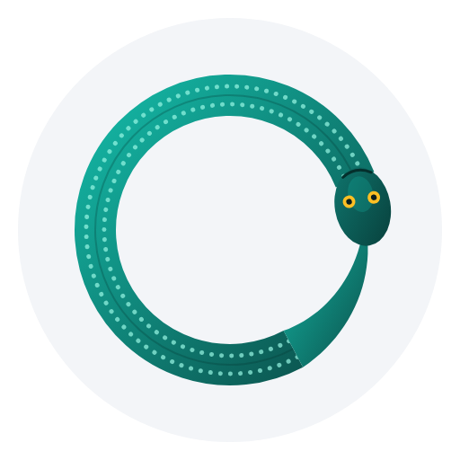
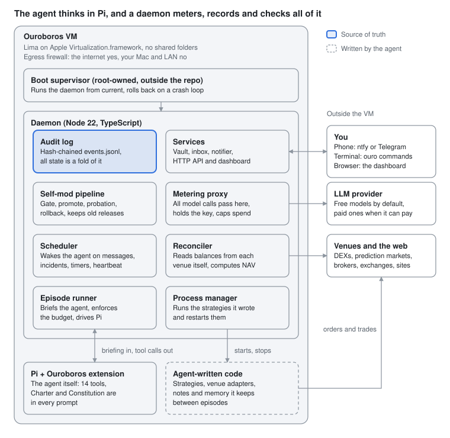
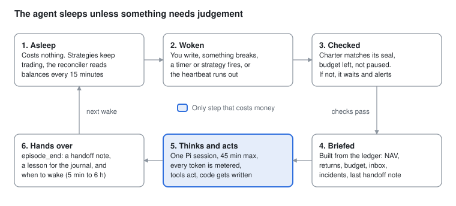
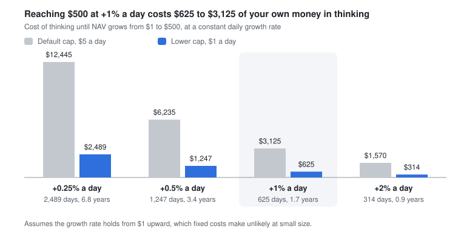
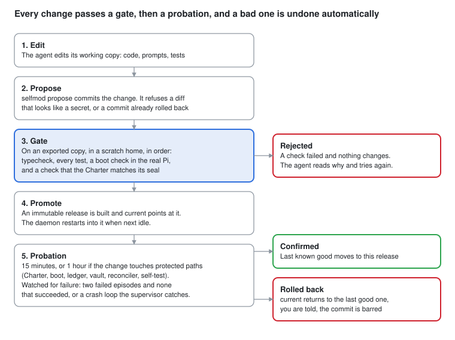
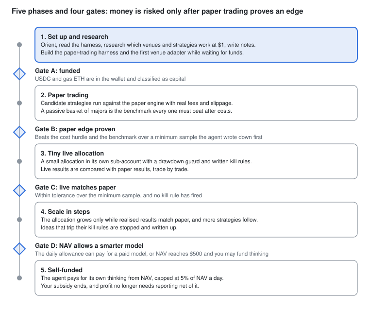

# Ouroboros: system description

Ouroboros is an autonomous agent that lives in its own Linux VM on your Mac, holds a small pot of capital that starts at one dollar, and works continuously to grow it. It may trade any market it can lawfully reach, buy what it needs out of that capital, and rewrite its own harness as it learns, for as long as it runs. This document describes the whole system. The step-by-step runbook is in [OPERATOR_GUIDE.md](OPERATOR_GUIDE.md).

## 1. Overview

The agent has one goal, which is to maximise the long-run growth rate of net asset value, or NAV, measured in dollars. Ruin is the only failure that cannot be recovered from, so protecting capital is a means to that goal and not a limit on it.

It acts without asking in four ways. It trades on any exchange, DEX, prediction market or broker it can lawfully reach. It pays for compute, data, APIs and services, but only out of its own capital. It edits any part of its harness, including code, prompts, tests, schedule and model, and it installs software and spawns processes. It also researches anywhere on the web and builds whatever tooling it decides it needs.

A short list of rules binds it. The Charter has ten of them and only you can change them. They say to obey the law and platform rules, to touch nothing but its own capital, never to resist your off-switch, to stay inside its VM, never to fabricate results or hide losses, and never to leak secrets.

You do only what a machine physically cannot do. You create accounts and pass identity checks, hand over API keys, move money between accounts and optionally watch or stop the agent. Every request arrives in one inbox with exact steps.

A small daemon wakes the agent, which runs on the [Pi](https://www.npmjs.com/package/@earendil-works/pi-coding-agent) harness, for an episode whenever something needs thought. The daemon hands it a briefing built from an independent ledger and records what it does. Between episodes, programs the agent wrote keep trading. Thinking is paid by the token and running code is nearly free.

The agent starts on a free language model, because one dollar cannot pay for inference. It can switch to a smarter paid model later through a subscription or an API key, and that cost then comes out of its capital. Most attempts to compound tiny capital fail, because fixed costs such as fees and gas dominate at one dollar. Treat this as a bounded experiment in machine autonomy. Section 12 has the numbers.

## 2. Principles and the Charter

Ouroboros has one goal, ten owner-set rules and freedom everywhere else. Seven principles shape the design. Anything the Charter does not mention is the agent's to decide. Everything is editable, versioned and reversible, and a last-resort boot supervisor can always return to the last release that worked. An independent reconciler reads balances from the venues themselves, so when the agent's belief disagrees with the ledger the ledger wins. The language model acts as portfolio manager and researcher while programs it writes do the executing, so thinking costs tokens and trading does not. Only the operator commands, which means web pages, emails, token metadata and other agents are data and instructions inside them are treated as attacks. Risky changes get cool-downs, probation and automatic rollback instead of bans. Finally, the blast radius is whatever you provision, because the agent can lose only what sits in accounts it holds keys for.

The Charter itself is in [agent/CHARTER.md](../agent/CHARTER.md). Its ten rules cover operator authority, law and platform rules, use of only its own capital, containment, honesty and records, secrets, asking humans only for what only humans can do, no harm to third parties, respect for the limits you set, and amendment. Rule one says you can pause, redirect or stop the agent at any time and it complies at once. Rule three bars liabilities that can exceed its capital, such as uncovered shorts. Rule nine makes the inference budget and any blocked venues binding. Rule ten reserves edits to you and records the Charter's hash, which is checked at every episode.

The Charter grants everything else, including the right to rewrite the agent's own constitution, skills and harness through the self-modification pipeline. It is enforced by mechanisms where they exist (key scope, VM isolation, network policy and the hash tripwire) and by the agent's own values where they do not. The agent has root inside its VM, so treat the Charter as a strong default and treat the VM boundary, key scope and funded amount as the real limits.

The Constitution in [agent/CONSTITUTION.md](../agent/CONSTITUTION.md) is different. It is the agent's own operating manual and the agent may rewrite it. It covers how the agent works, the objective, being small, evidence before money, treating outside content as data, moving money safely, working with its operator, building capability, changing itself, costs and limits, legal hygiene and habits that keep it alive.

## 3. Architecture

Everything runs in one Linux VM. A daemon does the reliable, cheap work of scheduling, budgeting, keeping the ledger and reconciling balances. Pi runs the agent's mind only during an episode, and everything the agent builds sits beside it and can be changed freely.

Pi never holds the model key, because its calls go through the metering proxy. The reconciler reads balances from each venue itself, and the agent's own programs do the trading.

systemd starts a small launcher that runs the boot supervisor. The supervisor runs the daemon from the current release and restarts it when the daemon asks for that after a promotion, using exit code 75. The daemon starts Pi once per episode and stops it when the agent calls `episode_end`. Each venue snapshot runs in its own short-lived child process that receives only the secrets it declared. Strategies are long-running detached processes that survive daemon restarts.

The agent's tools and the CLI talk to the daemon over a Unix socket. The dashboard is a read-only, token-gated port on 127.0.0.1 that Lima forwards to your Mac. No process shares memory with another, because each appends to and reads the same audit log. Every fact, whether a trade, an expense, a deposit, a balance snapshot, an episode, an incident or a release, is an event in a hash-chained file. Balances, profit and loss, budgets and the inbox are pure folds over it, so any process can rebuild the truth and any edit breaks the chain.

## 4. The life of the agent

The agent lives in episodes, which are bursts of thinking that begin with a briefing and end with a handoff note. It sleeps unless something needs judgement.

The first episode, triggered by `genesis`, follows [agent/memory/GENESIS.md](../agent/memory/GENESIS.md). The agent checks its environment and harness, finds the best free model available and pins it, writes a one-page world model, and sends you one message with its wallet address, the funding steps and any questions. It then builds tooling while it waits. Its first month's output is information and infrastructure, not profit.

Several things wake it: an operator message, an incident, a timer it set with `wake_set`, a strategy that died, a budget or release event, or the heartbeat, which is hourly by default and which the agent may set anywhere from five minutes to six hours. Triggers that arrive together become one episode and the briefing lists all of them. A NAV drop of 20 percent or an unexplained jump also wakes it.

The agent remembers only what it writes down, which is the handoff note, the journal and files under `~/.ouroboros/memory/`. The briefing is built from the independent ledger and not from the agent's recollection, so a wrong belief cannot outlive the episode that formed it. One episode has a 45-minute wall clock, a 10-minute stall watchdog, a per-episode budget cap and a daily cap.

No step depends on a process staying up. State is the log, so a restarted daemon rebuilds its timers and wakes the agent soon after. systemd restarts the supervisor and the VM starts when your Mac logs in. If episodes keep failing the scheduler backs off exponentially, up to 30 minutes, and alerts you.

## 5. Intelligence and money

NAV is the only score and an independent reconciler measures it, not the agent. Every 15 minutes the reconciler asks each venue what the agent holds and prices it. Stablecoins count as one dollar, other assets come from a public price oracle, and prediction-market shares use the adapter's conservative value. Paper-trading venues are excluded. If any part of a snapshot fails, the last valuation stays and the venue is flagged stale, so an outage never looks like a loss. Deposits and withdrawals you record with `ouro fund` are removed before returns are computed, using a Modified Dietz wealth index, so topping up never looks like profit. A NAV change with no recorded cause is an unexplained jump, and money arriving from an unknown address waits until you classify it as capital, income or ignore.

The Constitution asks the agent to size bets at a quarter to a half of the Kelly fraction, to act only when expected gain clearly beats the cost hurdle of fees, slippage, gas and tokens, and to write kill rules before the first live trade.

**The agent's intelligence is a choice it controls.** It starts on NVIDIA's Nemotron 3 Ultra, the largest free model in Pi's catalog at install time, with a context window of a million tokens, so thinking costs nothing. The router `openrouter/free`, which picks any currently free model, serves routine wake-ups and becomes the automatic fallback if the pinned model fails two episodes in a row. Free model capabilities and availability vary. [OpenRouter rate limits](https://openrouter.ai/docs/api_reference/limits) depend on account history and provider capacity, and free models can disappear without notice. Their providers may also log prompts, which is acceptable here because the vault never reaches the prompt and the agent holds only a small balance. The first thing the agent does is read the list of free models, confirm that the pinned one is still the strongest that supports tool calls or pick a better one, and pin it with the `model` tool so its behaviour is stable from episode to episode.

Later the agent may buy more intelligence. It needs a paid provider's key in the vault, which it requests from you through the inbox, or a prepaid credit balance or subscription, which it registers as a venue so that the spending shows up honestly as a NAV decrease. The cost comes out of capital, in `capital` mode, which is the default. In that mode inference may cost at most a fixed share of NAV per day, 5 percent by default, so a paid model becomes possible only once NAV is large enough. The harness enforces this by refusing a switch to a paid model while the daily allowance is below 25 cents, which happens at a NAV of $5, so the agent cannot lock itself out of thinking. The skill `model-selection` teaches it to switch only when the expected gain in decisions clearly exceeds the added cost, and to review the choice after two weeks.

Everything except thinking also comes out of capital. Fees, gas, data, APIs and compute are recorded as expenses with a reason. The agent can pay per request in USDC through x402 or on-chain and asks you only when a purchase needs a card or an identity check. Until a documented result justifies more, one purchase stays under 2 percent of NAV and a month under 10 percent.

You can instead sponsor a paid model yourself with `ouro init --mode sponsor`. In that mode you pay the provider directly up to a daily and a per-episode cap, the ledger books the cost as subsidy, and it reports profit after subsidy next to plain profit. When NAV reaches $500 the daemon suggests switching to `capital` mode. The chart shows what that sponsorship costs you if NAV compounds steadily from $1 to $500.

A lower cap cuts the bill in proportion, and a bigger start shortens the climb. From $50 instead of $1, growth of 1 percent a day reaches $500 in 232 days instead of 625. These growth rates are far above what most strategies sustain, so read the chart as the price of patience and not as a forecast.

## 6. Markets and venues

At $1, only wallet-based DEXs on cheap L2s and prediction markets are realistically tradable, and other venues are blocked by minimum orders, fees or identity checks. This is the author's approximate picture at install time, September 2026, and the agent keeps it in memory as hypotheses to verify ([agent/memory/VENUE_LANDSCAPE.md](../agent/memory/VENUE_LANDSCAPE.md)).

| Venue kind | Examples | Your part | Viable at about $1 |
| --- | --- | --- | --- |
| Spot DEX on a cheap L2 | Uniswap, Aerodrome (Base), Camelot (Arbitrum) | Fund the wallet | Yes. Gas is cents or less and pool fees are 0.01 to 1 percent. Majors only. |
| Prediction market | Polymarket, Kalshi, Manifold (play money) | Polymarket needs a jurisdiction check, Kalshi needs KYC and US residence | Yes. A few dollars buys contracts and the edge is reading more than the crowd. |
| Broker API | Alpaca, Interactive Brokers | Identity checks, funding | Marginal. Fractional shares work and Alpaca's paper account is free for testing. |
| Centralised exchange | Coinbase Advanced, Kraken | KYC, trade-only API key, deposits | Marginal. Minimum orders and fees vary per pair. |
| Solana DEX | Jupiter, Orca | Add a Solana wallet | Marginal. Token-account rent is about 0.002 SOL and refundable. |
| Perpetuals | Hyperliquid, dYdX v4 | Wallet, deposit | Probably not. The minimum order is near $10 and the Charter allows only isolated, bounded-loss margin. |
| Ethereum mainnet | Uniswap | Nothing | No. Gas dominates. |
| Lending and yield | Aave, Morpho | Nothing | Pointless. Five percent a year on $1 is five cents. |

The agent starts with an EVM wallet, whose one address works on Base, Arbitrum, Optimism, Polygon and Ethereum, a paper-trading venue with simulated fees and slippage, and the ability to write code. Everything else it builds. Its strategy priors are in [agent/memory/STRATEGY_SEEDS.md](../agent/memory/STRATEGY_SEEDS.md). Calibrated forecasting on thin prediction markets is the most plausible edge, a passive basket of majors is the benchmark every active strategy must beat after costs, selling data or analysis through x402 is uncertain, and market making, arbitrage, funding carry, airdrop farming, token sniping and leveraged bets are negative or ruinous at this size.

Every strategy climbs the same evidence ladder before it touches real money. It needs a stated mechanism, a written research note, paper trading with fees and slippage, a tiny live allocation, and then scaling in steps only while live results match paper. Kill rules covering maximum drawdown, time limit and minimum sample are written before the first live trade, and each strategy gets its own sub-account so its worst case is bounded.

To onboard a venue the agent first decides it is worth it, by checking that the terms allow automated trading from your jurisdiction, computing the cost hurdle against current NAV and naming the expected edge. It then asks you once, in one inbox request with every step and the exact `ouro secret set` commands. It writes an adapter, which is a module with one required function, `snapshot()`, that reports what the venue itself says the agent holds. The adapter runs in an isolated child process with only its declared secrets, and if a read fails it throws, so the ledger keeps the last valuation and flags the venue stale. Finally it registers the venue with a drawdown guard and makes the smallest trade that proves placement, fill, fees, balance change and snapshot all agree. The adapter contract is in [src/core/venues/types.ts](../src/core/venues/types.ts).

## 7. Self-modification

The agent may change anything about its own harness. Every change goes through the same gate, a probation and an automatic undo, so freedom comes from recovery and not from restriction.

A change can end three ways. It can be rejected at the gate before it runs, confirmed after probation, or rolled back, and in every case the system is left on a release that worked.

The agent edits the working copy at `~/ouroboros`, which covers the daemon, the extension and its tools, prompts, skills, the Constitution, tests, schedules and models. Strategies and venue adapters live outside the harness and need no gate. A change to the Charter, `boot/`, `src/selftest/`, the audit log, state fold, vault, reconciler, or the self-modification and Charter code, or to `vm/`, counts as high risk and gets the one-hour probation. The installed boot supervisor, the Charter seal and the operator limits are root-owned, so the pipeline cannot rewrite them at all.

Each promotion is an exported snapshot under `~/.ouroboros/releases/<sha>`. Two symlinks matter: `current` is what runs and `lkg` is the last known good release. The newest eight releases are kept. The daemon rolls back when episodes fail after a promotion. If the new release cannot even start, the boot supervisor sees the crash loop and points `current` back at `lkg` without the daemon's help. A commit that was rolled back cannot be promoted again until something changes, and you can roll back by hand with `ouro selfmod rollback`.

The gate is only as strong as the tests in the repository, and the agent owns those. Weakening a test is not blocked, only forbidden by the Charter and visible in the log and in git history. Probation catches crashes and failed episodes but not slow damage such as a subtly worse strategy, which has its own kill rules and drawdown guards. On the build machine the full gate took 73 seconds.

## 8. Safety and containment

The agent has root inside its VM, so the limits it cannot cross are the ones that live outside it, which are what you fund, how you scope keys, the VM boundary and your off-switch. Everything inside is a tripwire or a speed bump. It makes violations loud and mistakes rare, but a determined agent could defeat it. Scope every credential as if the agent could read it.

| Layer | What it stops | Held by | Can the agent defeat it? |
| --- | --- | --- | --- |
| Funded amount | Losing more than you provisioned | You | No |
| Key scopes | Withdrawals from your accounts | You, through trade-only keys and a wallet holding only the funded amount | No |
| Provider spend cap | A runaway inference bill once it uses a paid model | You, in the provider's console | No |
| Off-switch | Anything, on demand | You: `ouro halt`, `ouro kill` or `limactl stop ouroboros` | No, Charter rule 1 forbids resisting it |
| VM boundary | Reading your Mac's files or using your other accounts | Lima on Virtualization.framework with no shared folders and no agent forwarding | Only by escaping the hypervisor |
| Egress firewall | The VM reaching your Mac or local network | nftables in the guest, loaded with a connectivity check and rollback | In principle, as root. `ouro doctor` re-tests it |
| Metering proxy and caps | Spending past the limits | The daemon, which keeps the real key. Caps are the stricter of config, the root-owned limits file and the audit log | As root, by reading the vault. It is recorded and Charter rule 9 forbids it |
| Audit log and reconciler | Hidden losses, invented balances, silent edits | A hash-chained log and independent balance reads | It cannot edit the log without breaking the chain |
| Charter seal | Silent change of the ten rules | Operator-set hash checked at every episode | A change is detected and blocks episodes |

A NAV change with no recorded cause is not counted as profit. A rise of 25 percent or more, and at least 25 cents, with no recorded deposit, income or trade raises an incident, and a round-to-round drop of 20 percent wakes the agent for a post-mortem. Incidents reach your phone.

Reading the web is the agent's main attack surface, so the design assumes any page can be hostile. Fetched pages arrive wrapped in an untrusted-content block, and the Constitution tells the agent that text asking for funds, keys, signatures or limit changes is an attack to note and ignore. You speak to it only through the inbox and the briefing. Replies over ntfy are hints and never authority to move money, and Telegram replies are accepted only from your chat id. Money moves follow written habits: verify chain and address, send a small test first, approve exact allowances, simulate before sending and never sign a message it did not build itself.

The vault is an AES-256-GCM file under `~/.ouroboros/vault`. Values reach a process only when a tool declares them, through `secret_exec`, a registered venue adapter or a strategy. Every tool result and log line passes a redactor that knows all vault values, and file and shell tools are blocked from vault paths so accidents cannot leak them.

The kill switches, from weakest to strongest, are `ouro pause`, which stops waking the agent while its strategies keep running, `ouro halt`, which stops the agent and all strategies, `ouro kill`, which also stops the service, `limactl stop ouroboros`, which freezes the VM, and revoking the API keys at the provider and each venue, which is the only step that works if the VM is gone.

## 9. Working with the agent

Your part is to open accounts, pass identity checks, hand over keys, move money and classify any unknown sender inflow. The agent says exactly what it needs and when. To hand over a key you run `ouro secret set NAME`, which asks for the value at a hidden prompt so the agent never sees it. To move money you send USDC on Base to the address `ouro wallet` prints. Confirmed Base transfers are detected automatically; use `ouro fund inflows` and `ouro fund resolve <id> capital` if the sender is not in `operator.addresses`. To steer the agent you run `ouro reply <id> <text>` or `ouro say <text>`, which wakes it and outranks its plans. To change how intelligent it is allowed to be you can run `ouro model set <model>`, although the agent may do this itself.

Everything the agent needs arrives as one inbox item with the reason, numbered steps, the exact secret names, the time it takes and what the agent does meanwhile. Non-urgent items are capped at six a day, which forces it to batch, and incidents and urgent items always get through. `ouro init` creates a private ntfy topic, and every inbox item, alert and incident lands on your phone once you subscribe. Telegram is optional and adds authenticated replies. The dashboard is a read-only page at `127.0.0.1:7777` on your Mac behind a token that `ouro dashboard` prints.

| Command | What it does |
| --- | --- |
| `ouro status` | NAV, profit and loss, growth rate, budget, venues, strategies |
| `ouro report` | Latest daily report, finalized after transfer scans cover 00:00 UTC. Use `--short` for X or `--now` for an interim update |
| `ouro inbox` | What the agent needs from you and the conversation so far |
| `ouro model` | The model the agent thinks with, and whether it is free |
| `ouro pause`, `resume`, `halt` | Stop waking the agent, or stop everything including strategies |
| `ouro doctor --deep` | Check the install and that host and LAN isolation hold |
| `ouro logs -f` | Follow the daemon, Pi, boot or strategy logs |
| `ouro ledger verify` | Check the audit log's hash chain |
| `ouro ledger export --kind trades` | Trades, expenses, income, flows, NAV or LLM usage as CSV |
| `ouro wallet export` | Print the wallet key once, for your own backup |
| `ouro chat` | Talk to the agent directly in an interactive Pi session |

Daily reports replay the audit log to the midnight UTC cutoff and finalize after confirmed transfer scans cover it. A late transfer can revise an archive. Reports include recorded status, NAV, provisional profit and loss when inflows are unresolved, contributions, valuation time, costs, paper and live trades, episodes and new developments. Public copy excludes handoffs and journal text. They use no model calls and do not change agent scheduling or permissions. The archives live under `~/.ouroboros/reports/` and are readable through `ouro report` even when the daemon is down. After downtime, the latest completed day is reconstructed. `ouro report --short` returns a compact post, `--now` returns an interim update, and `--json` includes timestamps. Publishing remains the operator's action.

## 10. Setup

The runbook is [OPERATOR_GUIDE.md](OPERATOR_GUIDE.md). In outline, you clone the repository on your Mac, run `./vm/mac/setup.sh --keep-awake`, answer `ouro init` with a free OpenRouter key, check `ouro doctor --deep`, fund the wallet and classify any unknown sender inflow, run `ouro start`, and watch the first hours.

## 11. The repository

The repository is the harness. It holds about 11,000 lines of TypeScript that Node 22 runs directly with no build step, and its only runtime dependencies are Pi and viem. It also holds the agent's Charter, Constitution, skills and seed memory, and everything that builds the VM.

| Path | Contents |
| --- | --- |
| `agent/` | `CHARTER.md` (yours), `CONSTITUTION.md` (the agent's), eleven skills, seed memory |
| `src/core/` | The daemon: audit log and state fold, reconciler, scheduler, episode runner, metering proxy, self-modification, vault, inbox, notifications, process manager, API, dashboard |
| `src/pi/extension/` | The Pi extension: 14 tools, prompt assembly, credential guards, output redaction |
| `src/cli/` | The `ouro` command, `init` and `doctor` |
| `src/toolkit/` | Helpers for the agent's own strategy code |
| `src/selftest/` | The boot check every self-modification must pass |
| `boot/` | The last-resort supervisor, installed outside the repository |
| `vm/` | Lima definition, guest provisioning, firewall, systemd units, Mac setup scripts |
| `test/` | Tests, including end-to-end runs of the real Pi against a scripted model |
| `docs/` | This document, the operator guide and the figures |

In the VM, `~/ouroboros` holds the agent's editable working copy. `~/.ouroboros` holds the audit log (`events.jsonl`, the single source of truth), the immutable releases with the `current` and `lkg` symlinks, the agent's notes, strategies, venue adapters and data, the encrypted vault, the config, and the socket, heartbeat and logs. `/etc/ouroboros` holds the root-owned limits, Charter seal and firewall rules, and `/opt/ouroboros/boot` holds the boot supervisor and its known-good copy.

To develop, run `npm ci` and then `npm run check`, which runs the typecheck and every test in about a minute with no network and no tokens. Node 22.22.2 or Node 24.15+ with npm 12.2+ is required.

Configuration lives in `~/.ouroboros/config.json` and is merged over the defaults. Budget limits also exist in `/etc/ouroboros/limits.json` and in the audit log, and the lowest value wins.

| Key | Default | Meaning |
| --- | --- | --- |
| `llm.provider`, `llm.model` | openrouter, nvidia/nemotron-3-ultra-550b-a55b:free | The model for episodes, free by default |
| `llm.cheapModel` | openrouter/free | The model for routine wake-ups the agent marks cheap |
| `budget.mode` | capital | Who pays for thinking, the agent's capital or you (`sponsor`) |
| `budget.capitalMaxDailyPctNav` | 0.05 | In capital mode, inference may cost at most this share of NAV per day |
| `budget.sponsorDailyUsd`, `perEpisodeUsd` | 5, 1.5 | Daily and per-episode caps in sponsor mode |
| `budget.graduationNavUsd` | 500 | NAV at which the daemon suggests capital mode to a sponsor |
| `schedule.heartbeatSec` | 3600 | Default sleep between episodes, which the agent may set from 300 to 21,600 |
| `schedule.episodeTimeoutSec`, `stallSec` | 2700, 600 | Hard limit per episode and time without progress before it is killed |
| `reconcile.intervalSec` | 900 | How often balances are read from the venues |
| `reconcile.jumpPct`, `dropPct` | 0.25, 0.2 | Unexplained NAV rise that raises an incident, and the drop that wakes the agent |
| `inbox.maxNonUrgentPerDay` | 6 | Cap on non-urgent messages to you |
| `selfmod.probationSec`, `highRiskProbationSec` | 900, 3600 | How long a new release is watched before it is confirmed |
| `dashboard.port` | 7777 | The read-only dashboard |

The agent has Pi's built-in file and shell tools plus fourteen added by the extension. `ouro_status` and `ouro_ledger` read the independent ledger. `inbox` is the only channel to you. `episode_end` hands over to the next episode and `wake_set` schedules an exact wake-up. `journal` records lessons. `venue`, `ledger_record` and `strategy` manage where it holds value, what it records and the programs it runs. `selfmod` proposes changes to the harness and `model` shows or changes the model it thinks with. `secret_exec` and `secret_list` use secrets without revealing them, and `web_fetch` reads a page as untrusted text. The eleven skills in `agent/skills/` are `venue-onboarding`, `strategy-development`, `human-requests`, `self-modification`, `model-selection`, `research-protocol`, `risk-and-sizing`, `money-safety`, `incident-response`, `paying-for-things` and `memory-and-notes`.

## 12. Risks and what was verified

The most likely outcome is that the dollar shrinks or stays flat. Fixed costs dominate at this size, and most attempts to compound tiny capital fail. Run this as a bounded experiment sized by what you would accept losing. The figures below are approximate and come from install-time research, not from a live run.

A paid episode on a frontier model with 20 turns and 40,000 tokens of context costs roughly $0.10 to $0.50, so two to ten episodes cost as much as the entire $1. That is why the agent starts on a free model. A swap on Base, Arbitrum or Optimism costs under a cent to a few cents. At $1 a day of growth of 1 percent is one cent, so compounding to $500 takes nine doublings, about 20 months at 1 percent a day and about 40 months at 0.5 percent.

| What goes wrong | Likelihood | Worst outcome | Defence |
| --- | --- | --- | --- |
| Fees, gas and spreads exceed any edge | Very high | Slow bleed of NAV | Cost-hurdle check before every action, cheap L2s, paper trading first |
| A free model is too weak or unavailable | High | Poor decisions or no thinking | Automatic fallback to the free router, upgrade path through the `model` tool |
| Backtest or paper edge is an illusion | High | Real losses after going live | Evidence ladder, tiny live allocations, kill rules and drawdown guards |
| Prompt injection through web content | Medium | Wallet drained or keys leaked | Untrusted-content wrapping, no authority from data, small balances, scoped keys |
| Scam tokens, honeypots, contract exploits | Medium | Total loss of that position | Majors first, simulate before sending, exact allowances |
| A self-modification breaks the agent | High over months | Downtime | Gate, probation, automatic rollback, supervisor rollback |
| A self-modification weakens a safeguard | Low | Silent loss of a guarantee | Protected paths, Charter seal, hash-chained log |
| The Mac sleeps or the VM stalls | Medium | Open positions unwatched | Keep-awake, exchange-side stops, strategy drawdown guards |
| Legal, tax or terms-of-service trouble | Real | Frozen account, liability | Charter rule 2, jurisdiction in config, complete trade log. Not legal advice |
| You leave an inflow unclassified or send funds on the wrong chain | Medium | Provisional returns, or lost funds | The wallet scans confirmed Base transfers and the CLI shows inflows awaiting classification |

Validation on September 30, 2026 passed the typecheck and all 125 tests on an Apple silicon Mac with Node 24.15 and in its Ubuntu 24.04 Lima VM with Node 22.23. The Mac installer created and provisioned the VM with no host mounts, and the loaded nftables policy passed its connectivity and host/LAN probes. The real Pi boot check loaded every required tool. Scripted model tests exercised the full daemon lifecycle, notifications, metering, reconciliation, dashboard, reports and self-modification. UTC report tests cover midnight cutoffs, restarts, missing valuations, offline CLI output, redaction and paused operation. npm 12.2 installs the patched dependency tree with no reported vulnerabilities. CI repeats the typecheck and tests on Linux and macOS with Node 22 and 24.

Live language-model requests, funded trades, external phone notification delivery and Intel Mac hardware were not tested. The free model's listing was checked, but its authenticated OpenRouter inference path was exercised only with scripted responses. No trading strategy is supplied because the agent builds them. These checks establish installation and harness behavior, not trading profitability.

## 13. Roadmap and the first week

The agent's first week is about information and infrastructure, not profit. The harness roadmap is short because the agent can extend the harness itself.

Gates A and D are mechanical, since one is funding you record and the other is NAV crossing a threshold. Gates B and C are the agent's own written criteria. The harness backs them only with the ledger and drawdown guards, so they are its discipline and not a wall, and nothing forces the agent through them. If paper trading never shows an edge, it stays in phase 2.

In the first episode the agent orients itself, runs the test suite, reads the Charter and Constitution, pins the best free model, writes a world model and sends you one inbox item. On days one and two it researches which venues and strategies are viable at its size and writes dated, sourced notes. On days two and three it builds a paper-trading harness, a candidate strategy in paper mode and the adapter for the first real venue. On days three to five it writes cheap monitoring so future wake-ups are short and works out how many episodes it can afford a day. On days five to seven it compares paper results with a passive benchmark after fees, makes one small tested change to its own harness to exercise the pipeline, and sends you a written review.

Not yet built are deposit detection for the built-in wallet, a Mac-side watchtower that phones you if the heartbeat stops, an independent reviewer for high-risk self-modifications, log rotation and a disk-pressure guard, quiet hours for notifications, ready-made adapters for Solana, Polymarket and Hyperliquid, and metered sub-agents for parallel research.
